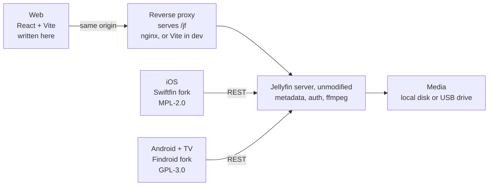
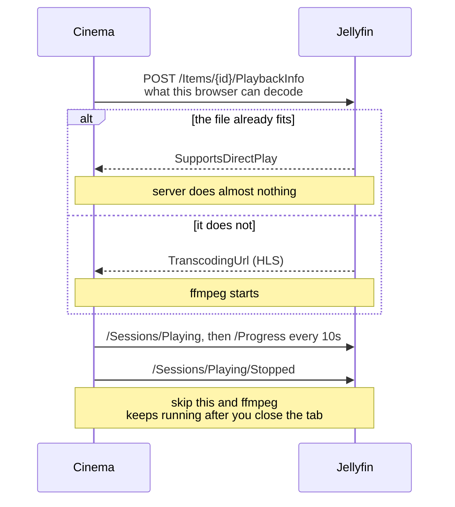
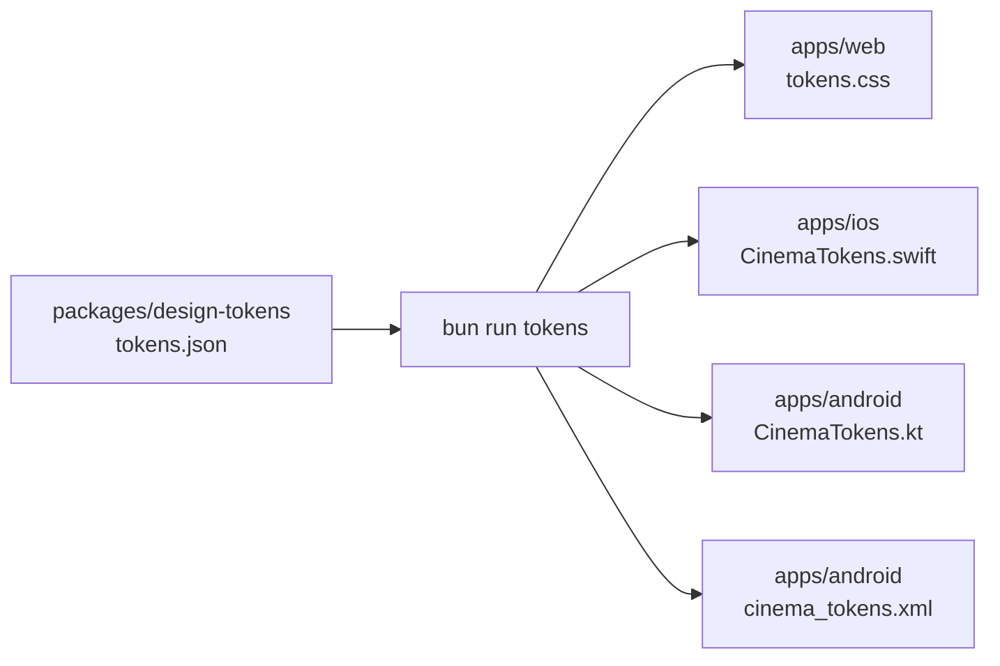

<div align="center">

# Cinema

**A front end for [Jellyfin](https://jellyfin.org) that owns every pixel — on the web, on iOS and on Android.**

[**Live**](https://cinema.davideghiotto.it) · [Architecture](docs/ARCHITECTURE.md) · [Design](docs/DESIGN.md) · [Deploy](docs/DEPLOY.md) · [Roadmap](docs/ROADMAP.md) · [Credits](NOTICE.md)

`MIT` for our code · `MPL-2.0` for the iOS fork · `GPL-3.0` for the Android fork

</div>

---

Jellyfin's own clients can be reskinned with CSS, but only inside the markup they already render.
Cinema replaces the interface instead. The server keeps doing what it is good at — libraries,
metadata, transcoding, playback — and everything in front of it is ours.

Three clients, one design language, **one Jellyfin, unmodified**. No server fork, no plugin, no
patched `jellyfin-web`.

## How it works



Four ideas carry the whole thing:

- **Everything goes through `/jf`.** The web client hands the Jellyfin SDK a *relative* base path,
  so API calls, artwork, video byte ranges and subtitles all resolve against our own origin and are
  forwarded by the proxy. CORS never happens, and the `api_key` in a stream URL never crosses an
  origin.
- **One directory knows about Jellyfin.** Nothing outside `apps/web/src/lib/jellyfin/` imports the
  SDK; components take plain data. An API change touches one folder.
- **Playback is negotiated, never guessed** — see below.
- **The palette is decided once** and emitted to three platforms, so the clients cannot drift apart.

### Playback

The naive version of this app builds a stream URL from an item id and transcodes 4K on every play.
Cinema asks first:



The player shows which path it took. "Transcoding" on a file you expected to direct play is almost
always the audio codec (AC3, DTS, TrueHD) or an MKV container — a browser limit, and the reason
native clients exist for the living room. [The long version](docs/ARCHITECTURE.md).

### One palette, three clients



Colour, radius, shadow and font values exist in exactly one file. The outputs are committed, so a
palette change is a reviewable diff — and hand-editing one is always wrong. The rules that keep the
three clients looking like one product are in [DESIGN.md](docs/DESIGN.md).

## Quickstart

```sh
cp .env.example .env    # media paths + JELLYFIN_URL
bun install
bun run dev:all         # Jellyfin in Docker + http://localhost:5173
```

Sign in with your Jellyfin username and password. `dev:all`
([`services/jellyfin/dev.sh`](services/jellyfin/dev.sh)) brings the container up, waits for its API,
then starts Vite; `bun run dev` is the front end alone, against a Jellyfin you started yourself.
Ctrl+C stops Vite and leaves the container running.

The mobile apps are in the same clone and need no extra step — their toolchains are Xcode and
Android Studio, and their READMEs have the rest.

| Command | Does |
|---|---|
| `bun run dev` | Vite only, on `:5173` |
| `bun run dev:all` | Jellyfin container + Vite |
| `bun run build` | Regenerate tokens, type-check, bundle `apps/web` |
| `bun run tokens` | `tokens.json` → web CSS, Swift, Kotlin, Android XML |
| `bun run lint` | oxlint |

## Layout

| Path | What lives there |
|---|---|
| [`apps/web`](apps/web) | React + Vite SPA. The reference implementation of the design. |
| [`apps/ios`](apps/ios/README.md) | Swiftfin fork, vendored. Build notes, palette, simulator traps. |
| [`apps/android`](apps/android/README.md) | Findroid fork, vendored. Phone and TV. |
| [`packages/design-tokens`](packages/design-tokens) | `tokens.json` and the generator. |
| [`services/jellyfin`](services/jellyfin) | The one-command dev stack. |
| [`services/web`](services/web) | Production nginx image + compose. |
| [`docs`](docs) | Four documents, one job each. |

**One repository, one remote.** The two mobile apps are forks vendored as ordinary source — no
submodules, nothing to check out. What that costs is `git merge upstream/main`; each fork's README
records the upstream version it was forked from and how to take a fix by hand.

## Films on an external drive

Mount the drive read-only at its own root and lay films out as `Film Name (Year)/Film Name (Year).mkv`.
`dev:all` decides the mount set at startup, so **the stack still comes up with the drive unplugged**.

Jellyfin does not notice a missing disk — its metadata lives in its own database, so it keeps
answering "directly playable" for a film that is 404 on the wire. Cinema checks for itself with a
one-byte range request and shows an offline state instead of a dead Play button.
[How, and why the cache header matters](docs/ARCHITECTURE.md).

## Where it stands

- **Web — live** at <https://cinema.davideghiotto.it>, with Jellyfin behind it at `/jf`.
- **iOS** — palette, home screen, chrome and icon are Cinema's. The poster rows are still upstream's.
- **Android** — same feature band on phone and TV, dark-only like the rest. Rows still upstream's.

[ROADMAP.md](docs/ROADMAP.md) has the ordered list, what the last cleanup measured, and enough
context to pick any of it up cold.

## Credit

Most of the code here is not ours. The iOS app is a fork of
[Swiftfin](https://github.com/jellyfin/Swiftfin) by Jellyfin & Jellyfin Contributors (MPL-2.0); the
Android app is a fork of [Findroid](https://github.com/jarnedemeulemeester/findroid) by Jarne
Demeulemeester (GPL-3.0). Both are vendored here with their licences intact and published as those
licences ask. [Jellyfin](https://jellyfin.org) itself is unmodified and does all the work Cinema
does not.

What is ours — `apps/web`, `packages/`, `services/`, `docs/`, and the Cinema files inside the forks
— is MIT, © 2026 Davide Ghiotto ([@davide97g](https://github.com/davide97g),
[davideghiotto.it](https://davideghiotto.it)).

[**NOTICE.md**](NOTICE.md) maps every part of the tree to its authors and its licence, down to the
fonts. If something is miscredited there, open an issue — that is worth fixing quickly.
