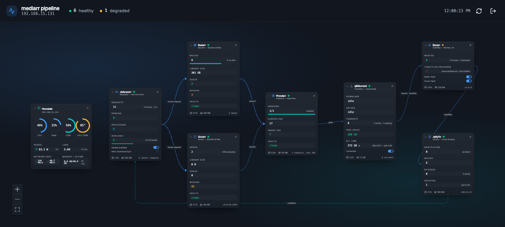

# Dashboard

> **Retired on 2026-09-20. Nothing here runs any more.**
>
> The pipeline graph lives on the hub, at `monitoring.davideghiotto.it/media`
> — see [`../hub`](../hub). The container is gone from the box,
> `mediarr.davideghiotto.it` no longer resolves, and its Cloudflare Access
> application and tunnel ingress rule have been deleted. `~/mediarr-dash` on the
> box is still there and is now just files.
>
> This tree is kept as a reference, not as a thing to run: its collectors are
> where the hub's ported ones came from, and `CLAUDE.md` holds notes on what the
> upstream APIs actually do that are still true. Two of them are **not** true in
> here any more, and both were fixed in the port: Jellyfin 12.1 answers 401 to
> the `X-Emby-Token` header this app still sends, and the busy-edge rule reads
> stats back out of their rendered strings by English label.

One page showing the media pipeline as a graph: every service a node, every hop
an edge, live numbers on each card and the box's own load behind them. Password
protected, meant for one person.



The shape on screen is the shape in [`../media-pipeline.md`](../media-pipeline.md)
— a request enters at Jellyseerr on the left and leaves as a playable file at
Jellyfin on the right, with a dashed line running back underneath for the
availability signal that closes the loop. An edge animates only while something
is actually moving along it, so a quiet pipeline looks quiet.

Click a node for the detail drawer: the torrents, the requests, who is watching
what. The arrow in a node's corner opens that service's own web UI.

## Layout

| Path | Role |
|---|---|
| `frontend/` | Vite + React + TypeScript, shadcn/ui components, React Flow for the canvas. |
| `server/` | Hono on Node. Talks to the services, serves the built frontend. |
| `Dockerfile` | Builds both, ships one container. |
| `docker-compose.yml` | What runs on the box. |
| `deploy.py` | Copy up, build there, deploy. |
| `scripts/collect-env.sh` | Writes the box's `.env` from the running containers. |

One container serves both the API and the page, so there is one origin, one
port, and nothing to configure for CORS — and one thing for the Cloudflare
Tunnel to point at later.

## What each node reads

| Node | Source | Shows |
|---|---|---|
| Homelab | Prometheus, from the [monitoring stack](../monitoring) | CPU, RAM, disk, temperature, estimated watts, load, `eno1` throughput, uptime, and per-container CPU and memory from cAdvisor |
| Jellyseerr | `/api/v1` | request counts, what is pending or processing, availability, the eight latest requests with titles |
| Radarr / Sonarr | `/api/v3` | library size and count, queue with per-item progress, missing, health |
| Prowlarr | `/api/v1` | indexers enabled, queries and grabs in the last 24 h, failures |
| qBittorrent | `/api/v2` | up and down rates, torrents by state, free space, all-time totals |
| Bazarr | `/api` | wanted subtitles, throttled providers, whether the Radarr and Sonarr SignalR feeds are live |
| Jellyfin | REST | who is playing what, whether it is transcoding and why, library counts |

Per-container CPU and memory appear in the footer of every service card, which
is what makes "which one is busy" answerable at a glance.

## Deploy

Everything runs on the box. The image is built there too — there is no registry
in this setup, and Dokploy's Raw compose provider can only name an image, not
build one.

```sh
./deploy.py              # copy up, build the image, bring the stack up
./deploy.py --no-build   # redeploy without rebuilding
./deploy.py --logs       # follow the container log afterwards
```

Then, once, on the box:

```sh
ssh -t homelab 'bash ~/mediarr-dash/scripts/collect-env.sh'
```

That reads the Radarr, Sonarr, Prowlarr, Bazarr and Jellyseerr API keys straight
out of the running containers and asks for the three things it cannot read: the
Jellyfin API key, the qBittorrent login, and the password for the dashboard
itself. It writes `/home/davide/mediarr-dash/.env`, mode 600. **The keys never
leave the box** — not into this repo, not onto a laptop, not through Dokploy.

Re-running is safe; it keeps what you typed and refreshes the rest. With
`NONINTERACTIVE=1` it asks nothing, which is the form to use after rotating an
\*arr key.

The dashboard lands on `http://debian:3002`.

### Through Dokploy

`deploy.py` uses Dokploy when `.dokploy.env` names a compose app, and falls back
to plain `docker compose` on the box when it does not — which is also what
happens if Dokploy is ever down.

1. Dokploy → project → **Create Service → Compose**, provider **Raw**.
2. Paste `docker-compose.yml`.
3. Deploy. Leave the Environment tab empty; the secrets come from the `.env`
   file on disk, which is the point.
4. Copy the compose id out of the browser URL into `.dokploy.env`:

```
DOKPLOY_URL=http://debian:3000
DOKPLOY_API_KEY=<Dokploy → Settings → API/CLI>
DOKPLOY_COMPOSE_ID=<from the URL>
```

That file is gitignored. The key is full-access — it can deploy, modify and
delete every service on the box — so keep it out of git and rotate it in Dokploy
if it is ever copied anywhere.

### Behind the tunnel

The dashboard is served at **https://mediarr.davideghiotto.it**.

`cloudflared` runs as a host systemd service on the box and is token-run, so its
routes live in the Cloudflare Zero Trust dashboard, not in a file on the box:
Networks → Tunnels → *(this tunnel)* → Public Hostname. The route for this app
is `mediarr.davideghiotto.it` → `http://localhost:3002`.

The `.env` on the box carries what that implies:

- `COOKIE_SECURE=true` — the session cookie is marked `Secure`. **Side effect:
  logging in over `http://debian:3002` no longer works**, because a
  browser discards a `Secure` cookie that arrives over plain HTTP. Use the
  public hostname.
- `JELLYFIN_PUBLIC_URL`, `JELLYSEERR_PUBLIC_URL`, `GRAFANA_PUBLIC_URL` — the
  node links, so a remote browser is not handed a LAN address it cannot reach.

A Cloudflare Access self-hosted application is in front of the hostname (team
domain `sooshi.cloudflareaccess.com`), so every path — `/healthz` included —
answers `302` to the Access login until a session exists. The dashboard password
stays as the second layer behind it.

That means `curl` against the public hostname no longer works without an Access
service token. The end-to-end check in `CLAUDE.md` goes to `127.0.0.1:3002` on
the box, below the tunnel, and is unaffected.

## Development

```sh
pnpm install
pnpm dev
```

Vite serves the page on `:5173` and proxies `/api` to the server on `:8080`, so
the session cookie is same-origin in development exactly as in production. The
server needs a `.env` next to it to start; point `API_TARGET` elsewhere to run
the frontend against a server that already has one.

## Theme

[tweakcn "ESLinks"](https://tweakcn.com/themes/cmmaobxtw000004l7fivrgmwy), copied
verbatim into `frontend/src/index.css` so it stays diffable against its source.
Dark only — `<html class="dark">` is hard-coded — though the light set is kept so
the shadcn components still behave if that ever changes.

## Notes

- **Polling, not push.** The page asks every 5 seconds and pauses while the tab
  is hidden. The server caches each snapshot for 4 seconds and shares an
  in-flight refresh, so several open tabs do not multiply the load on the \*arrs.
- **Library counts are cached for a minute.** Radarr and Sonarr have no count
  endpoint, so the whole collection comes back; that is the one expensive call
  here and it does not change between two polls.
- **qBittorrent needs a real login.** Its "bypass authentication for localhost"
  default does not cover a request from another container, so a 403 means the
  Web UI wants credentials. Set a permanent password in qBittorrent → Options →
  Web UI and re-run `collect-env.sh`. Adding the Docker bridge to
  `Options → Web UI → Bypass authentication for clients in whitelisted subnets`
  is the alternative.
- **The Prometheus network name is Dokploy's.** It carries the monitoring app's
  slug, so renaming that app breaks the host card. `docker network ls` shows the
  current name; set `MONITORING_NETWORK` if it moves.
- **Watts are modelled, not measured.** The number comes from the monitoring
  stack's recording rule — the amdgpu rail plus a fixed platform offset — and is
  labelled `est.` for that reason.
